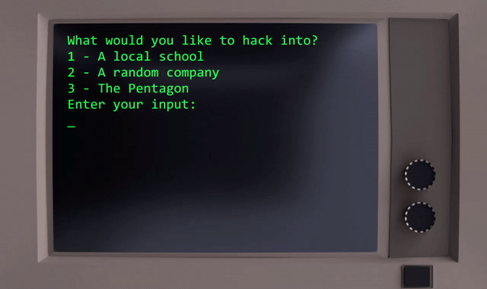
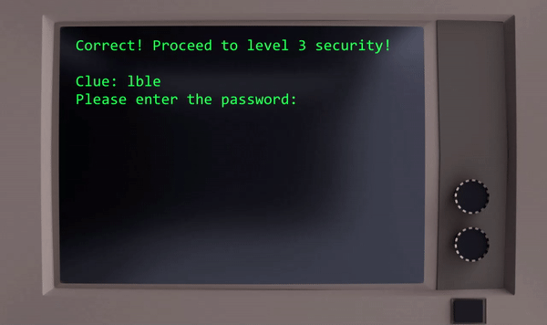

# Im-In
I'm In is a game that was made with Unity using C#. You play as a hacker trying to hack into different facilities by solving scrambled words. At the end, you can decide what to with the information you got.
 
 

 
 - The whole game uses the keyboard to navigate around.
 - You can type "menu" in any screen to return back to the main menu.
 - Uses the provided input options to select the facility you want to break in.
 
 
 
  

  
  - Each level provide you with a clue which is the scrambled words that you have to unscramble.
  - Everytime you guess wrong, the clue will rescramble to help you with figuring out the word.
  - You will have 3 choices at the end of each facility: good, evil, and self.
  
 
 
 Clone the repo and run the file in the executable folder to try it now!
